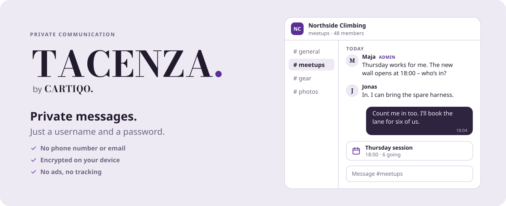
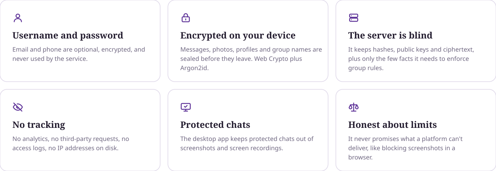

<picture>
  <source media="(prefers-color-scheme: dark)" srcset="./assets/header-dark.svg">
  <source media="(prefers-color-scheme: light)" srcset="./assets/header-light.svg">
  
</picture>

<br>

Tacenza is an end-to-end encrypted messenger built to know as little about you as possible. You sign up with a username and a password, and nothing else. Everything you send is encrypted on your device before it leaves, so only you and the people you write to can read it.

<br>

<picture>
  <source media="(prefers-color-scheme: dark)" srcset="./assets/principles-dark.svg">
  <source media="(prefers-color-scheme: light)" srcset="./assets/principles-light.svg">
  
</picture>

## What's in it

| | |
|---|---|
| **Chats** | One-to-one chats, and groups with no member limit. Owners, admins and per-member permissions, invite links with expiry and approval, and slow mode. |
| **Messages** | Text, photos, files, locations and contact cards. Disappearing messages from 5 minutes to 7 days. Delete for everyone. |
| **Live location** | Share where you are with the people you pick, for 15 minutes, 1 hour, 8 hours or until you stop. |
| **Safety** | Safety numbers for every contact, a message requests folder for people you haven't written to, and blocking that happens on your device. |
| **Protected content** | Per chat: no copying or forwarding, and an optional watermark on photos. The Windows app keeps its window out of screenshots and screen recordings. |
| **Bots** | Create a bot in Bot Studio, then run it with the Bot API and the `@tacenza/bot` SDK for Node.js. Bots get their own keys like everyone else. |
| **Your way** | Log out when inactive, hide chats when the app isn't in focus, light and dark themes, three text sizes, English and Danish. |

## Honest about limits

> **If you forget your password, nobody can recover your account.** That is the price of nobody else being able to read along.

- A web page can't block screenshots. The desktop app can, so by default protected chats can only be read there.
- The server knows who is in which group, because it has to enforce roles and permissions. It can't read names, messages or profiles.
- Forward secrecy (the Signal protocol and MLS) is planned for after 1.0. Until then, groups get a new key after 50 messages and on every membership change.

## Verify it yourself

The code isn't open source, so you shouldn't have to take our word for it. Here is what you can check on your own.

**Everyone gets the same app.** For every release, our build pipeline publishes the SHA-256 of the app's JavaScript in [tacenza/releases](https://github.com/tacenza/releases), a record kept apart from the servers that run Tacenza. Hash the file your browser is served and compare it with the latest release:

```bash
curl -s https://chat.tacenza.app/assets/<file from bundle-hash.txt> | sha256sum
```

The Windows app loads the same code, so the same hash applies there.

**Nothing goes to anyone else.** Open your browser's developer tools and watch the Network tab while you use Tacenza. Every request goes to Tacenza itself. There are no analytics, fonts or scripts from third parties.

**Nobody is in the middle.** Compare safety numbers with the people you write to, in person or on a call. If they match, your messages are encrypted to them and nobody else. If someone's keys ever change, the chat locks until you've checked again.

## Status

Tacenza is in development, working towards 1.0: an installable web app, a Windows desktop app and a self-hosted backend.

<br>

<picture>
  <source media="(prefers-color-scheme: dark)" srcset="./assets/divider-dark.svg">
  <source media="(prefers-color-scheme: light)" srcset="./assets/divider-light.svg">
  
</picture>

<br>
<br>

<p align="center">
  <picture>
    <source media="(prefers-color-scheme: dark)" srcset="./assets/tacenza-lockup-reversed.svg">
    <source media="(prefers-color-scheme: light)" srcset="./assets/tacenza-lockup.svg">
    
  </picture>
</p>

<p align="center"><sub>TACENZA. is a CARTIQO. product.</sub></p>
